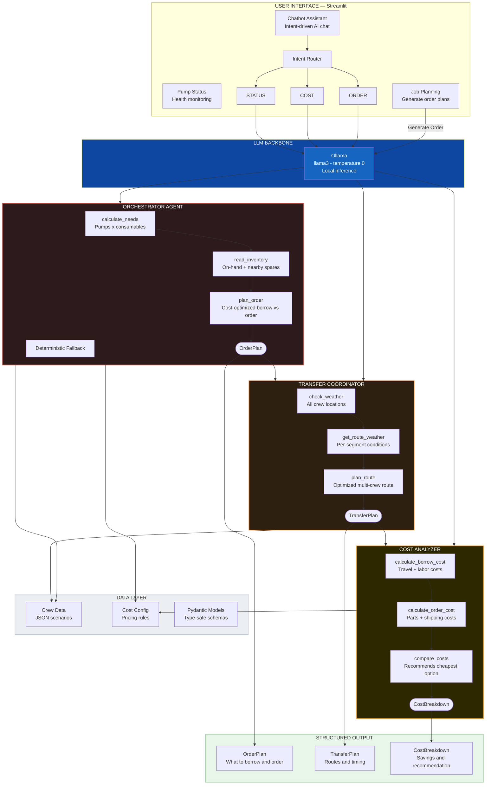
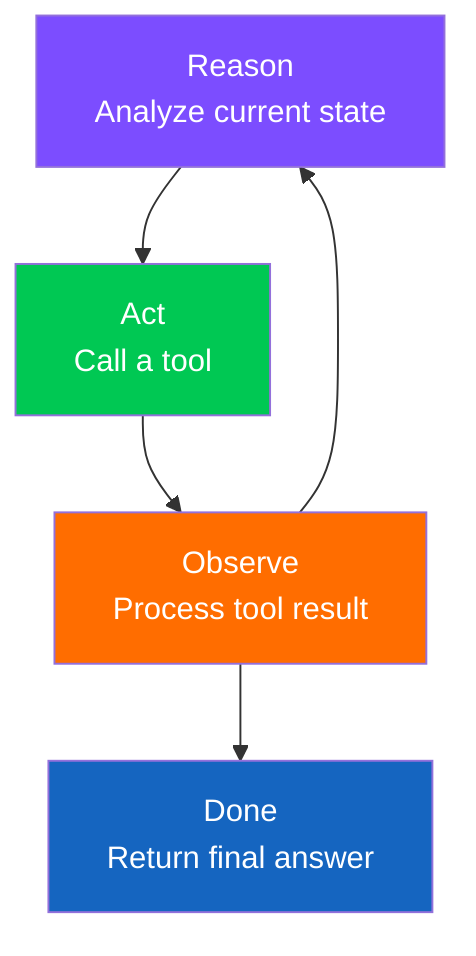
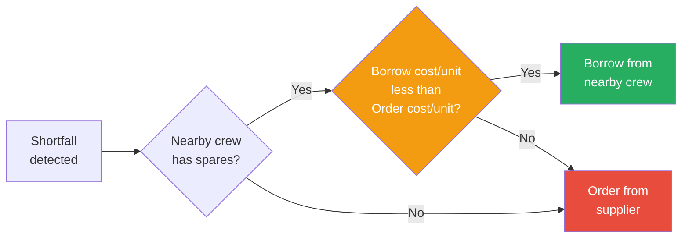

# Frac Consumables Planner — Multi-Agent Architecture

> Powered by LangChain + LangGraph | ReAct Pattern | Ollama (llama3)

## System Architecture



## Agent Descriptions

| Agent | Purpose | Tools | Status |
|-------|---------|-------|--------|
| **Orchestrator** | Plans consumable orders for Crew A. Tries LLM-guided tool calls first, falls back to deterministic pipeline. | `calculate_needs`, `read_inventory`, `plan_order` | Active |
| **Transfer Coordinator** | Plans logistics routes for borrowing consumables between crews. | `check_weather`, `get_route_weather`, `plan_route` | Defined |
| **Cost Analyzer** | Compares borrow vs order costs with weather-adjusted pricing. | `calculate_borrow_cost`, `calculate_order_cost`, `compare_costs` | Defined |
| **Chatbot** | Conversational assistant with intent routing (STATUS / ORDER / COST). | Direct LLM call | Active |

## ReAct Loop

Each agent follows the ReAct (Reason + Act) pattern:



## Decision Flow — Cost-Optimized



## Cost Formulas

### Borrow Cost
```
trip_distance  = crew_distance x 2  (round trip)
travel_cost    = trip_distance x cost_per_mile
travel_time    = trip_distance / average_speed_mph
labor_cost     = travel_time x weather_multiplier x cost_per_hour_labor
borrow_total   = travel_cost + labor_cost
cost_per_unit  = borrow_total / quantity_borrowed
```

### Order Cost
```
shipping_per_unit = (base_shipping + per_unit_cost x quantity) / quantity
cost_per_unit     = unit_price + shipping_per_unit
```

### Weather Multipliers
| Condition | Multiplier | Effect |
|-----------|-----------|--------|
| Clear | 1.0x | No impact |
| Rain | 1.3x | Moderate delay |
| Heavy Rain | 1.6x | Significant delay |
| Storm | 2.0x | Major delay |
